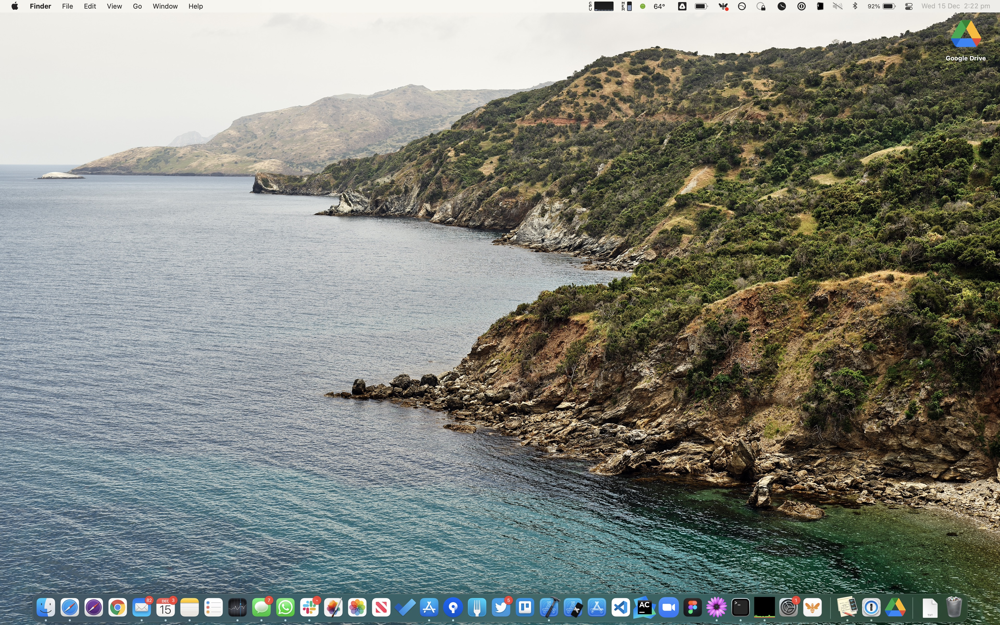

# esusatyo dotfiles

## Usage

```zsh
$ /bin/bash -c "$(curl -fsSL https://raw.githubusercontent.com/Homebrew/install/HEAD/install.sh)"
$ git clone https://github.com/esusatyo/dotfiles.git ~/dotfiles
$ cd ~/dotfiles && ./install.sh
```

Install manually:
- https://matthewpalmer.net/rocket/
- https://www.macgpt.com
- https://karabiner-elements.pqrs.org


Others:
- Re-pair Bose Bluetooth headphone
- Re-pair mouse and keyboard
- Karabiner elements setting: 

## Dock and Menu bar



# Thank you

- [mas](https://github.com/mas-cli/mas)
- [rogchap](https://github.com/rogchap)

